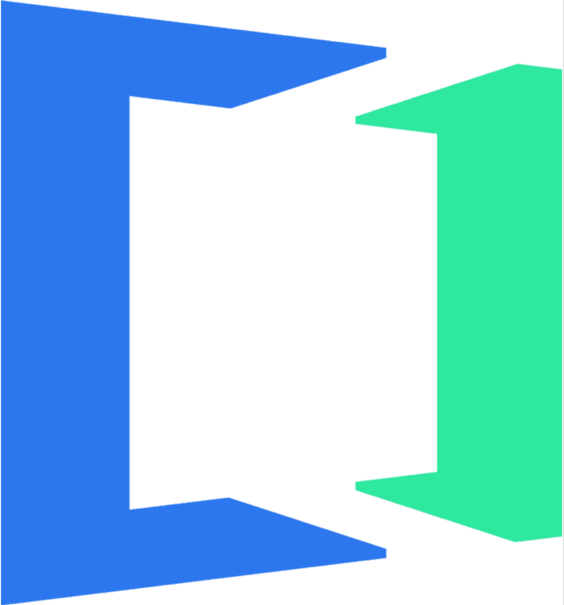
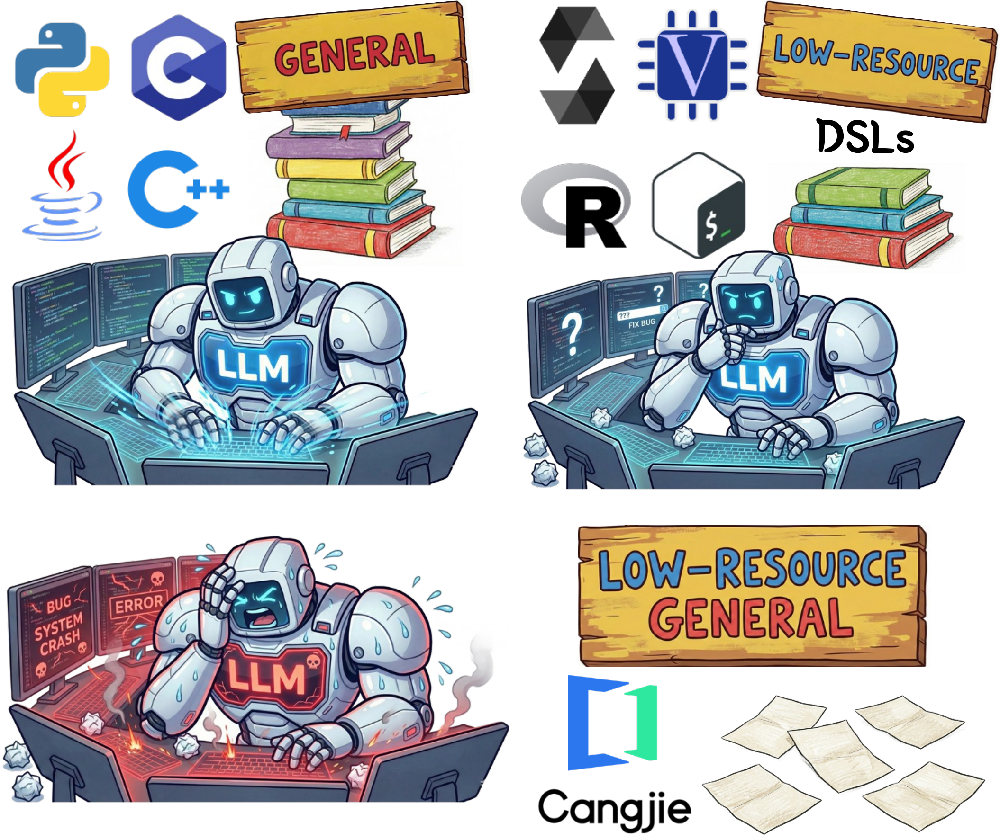
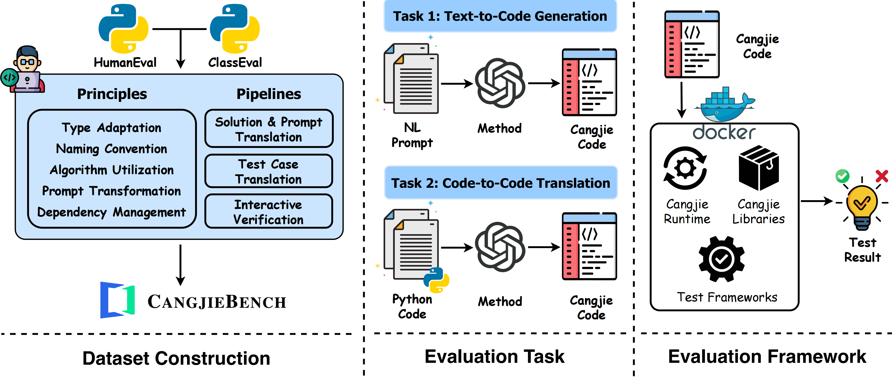
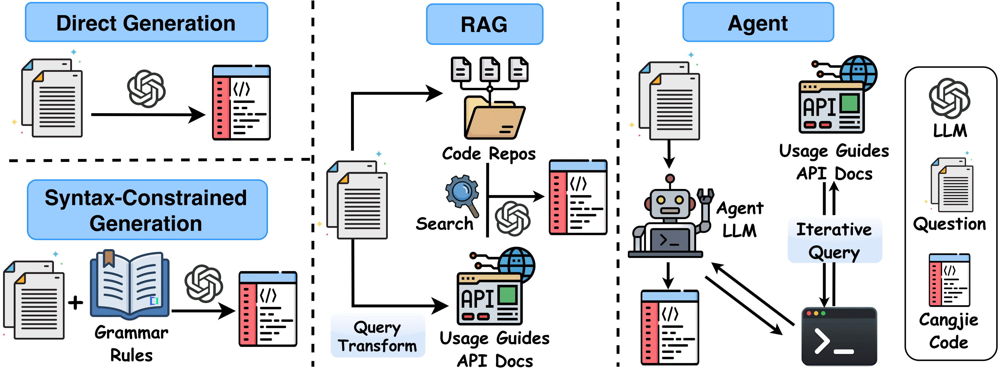
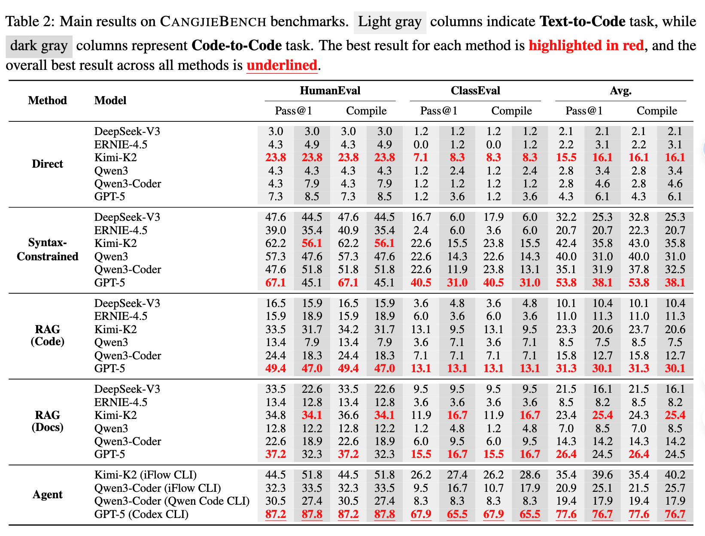

# [Submitted to ACL 2026]  CANGJIEBENCH: Evaluating LLM Generalization on a New Low-Resource General-Purpose Language

<p align="center">
    
</p>

<p align="center">


</p>


<h5 align="center">If you like our project, please give it a star ⭐ to show your support！Thank you:)</h5>

<h4 align="center">
    <strong><a href="./README_zh.md">🇨🇳 中文</a></strong> | <strong><a href="./README.md">🌐 English</a></strong>
</h4>

- [🤔 What is Cangjie?](#🤔what-is-cangjie?) 
- [🚀 Quickstart](#🚀quickstart)
- [🛠️ Usage & Evaluation](#🛠️usage--evaluation)
- [👋 Overview of Our Report](#👋overview-of-our-report)
- [📈 Results](#📈results)
- [❓ Checklist](#❓checklist)

# 🤔What is Cangjie?

Cangjie (designed by [Huawei](https://www.huawei.com/en/)) is a next-generation programming language designed for all-scenario intelligence. It features native AI support, innate all-scenario versatility, high performance, and robust security. Cangjie is suitable for application development across diverse device-cloud environments, providing developers with an exceptional programming experience.

* [**Cangjie Official Website**](https://cangjie-lang.cn/en): The official website of Cangjie, providing documentation, tutorials, and community support.
* [**Cangjie Homepage (HarmonyOS Developer)**](https://developer.huawei.com/consumer/cn/cangjie): Toolchains and learning resources for Cangjie application development on HarmonyOS.
* [**Cangjie Compiler**](https://gitcode.com/Cangjie/cangjie_compiler): Source code for the Cangjie compiler and the `cjdb` debugging tool.
* [**Cangjie Runtime**](https://gitcode.com/Cangjie/cangjie_runtime): The runtime environment and standard library for the Cangjie programming language.


# 🚀Quickstart

## Requirements

* **Operating System**: CangjieBench works on any platform that supports Docker.
* **Docker**: A running Docker instance is required for the Sandbox environment. We encapsulate the complete Cangjie runtime and testing frameworks in a lightweight container.
* **Python**: A virtual environment is recommended (`python -m venv .venv`).

## 📂 Repo Structure

* **`CangjieBench/`**: The core benchmark module.
    * [CangjieBench/README.md](./CangjieBench/README.md) introduce the setup of the Cangjie Sandbox environment.

* **`CangjieCodeCorpus/`** & **`CangjieDocCorpus/`**: The knowledge bases used for RAG and Agent methods.

* **`Prompts/`**: Prompt templates corresponding to our four experimental methods (Direct, Syntax-Constrained, RAG, and Agent).

* **`Results/`**: Stores the outputs from various LLMs for each experimental method.

* **`Evaluate/`**: Scripts to evaluate the outputs.

# 🛠️Usage & Evaluation

To reproduce our results or evaluate new models, follow the pipeline below.

### 1. Environment Setup

Before running any evaluation, you must set up the Python environment and initialize the Cangjie Sandbox.

**Install Python Dependencies:**

```bash
pip install -r requirements.txt
```

**Initialize the Sandbox:**
The evaluation relies on a Docker container to compile and run Cangjie code safely. Please refer to [CangjieBench/README.md](./CangjieBench/README.md) for detailed build instructions. Run this command after building the Docker image.

```bash
# Basic run (Map host 8080 to container 8080)
docker run -it -p 8080:8080 cangjie-sandbox:1.0

# Check running containers
docker ps

# Check logs
docker logs <container_id>
```

> [!IMPORTANT]
>
> Ensure the Docker container is running (`docker ps`) before proceeding. The evaluation script communicates with this container via a local API to execute the code.

### 2. Running Evaluation

Once the Sandbox is active, you can use the scripts in the `Evaluate/` directory to assess the model outputs stored in `Results/`.

The `evaluate.py` script reads the generated code, sends it to the Docker sandbox for compilation and testing, and computes the detailed metrics.

**Basic Usage:**

```bash
python Evaluate/evaluate.py \
    --dataset [HumanEval|ClassEval] \
    --input_file ./Results/Text_to_Code/Direct/DeepSeek-V3_HumanEval.jsonl
```

**Parameters:**

* `--dataset`: Specify the dataset being evaluated (`HumanEval` or `ClassEval`).
* `--input_file`: Path to the generation file inside the `Results/` directory (e.g., `Results/Text_to_Code/Direct/DeepSeek-V3_HumanEval.jsonl`).

### 3. Reviewing Results

After the script finishes, it will print the summary metrics (Pass@1, Compile Rate, etc.) to the console.

### 4. Evaluate Your Own Models or Methods

If you want to test a new LLM or a new Method on CangjieBench, follow these steps to prepare your data and run the pipeline.

#### Step 1: Load the Prompts

Read the problem descriptions and function signatures from the ground-truth datasets provided in the `CangjieBench/` directory:

* **HumanEval**: `CangjieBench/HumanEval_Cangjie.jsonl`
* **ClassEval**: `CangjieBench/ClassEval_Cangjie.jsonl`

#### Step 2: Generate Solutions

Ensure the model generates valid Cangjie code (functions for HumanEval, classes for ClassEval).

#### Step 3: Format the Output

Save your model's generations into a **JSONL** file. The evaluation script requires strict adherence to the following key structure:

* `id`: It must match the `id` from the source dataset.
* `solution`: The raw code generated by the model.

**Example `output_HumanEval.jsonl`:**

```json
{"id": 0, "solution": ""}
{"id": 1, "solution": ""}
```

**Example `output_ClassEval.jsonl`:**

```json
{"id": "0", "solution": ""}
{"id": "1", "solution": ""}
```

#### Step 4: Execute Evaluation

Once your output file is formatted correctly, run the standard evaluation command:

```bash
python Evaluate/evaluate.py \
    --dataset HumanEval \
    --input_file ./path/to/output_HumanEval.jsonl #change to the real path 
```

# 👋Overview of Our Report

<p align="center">
    
</p>

**CangjieBench** is the first comprehensive benchmark designed to evaluate Large Language Models (LLMs) on the **Cangjie** programming language. Due to the scarcity of high-quality open-source Cangjie code, we adopted a rigorous translation-based strategy to construct a ground-truth dataset that ensures correctness and minimizes bias.

## 📊Dataset Construction

Unlike repository-level benchmarks that introduce complex dependencies, we focus on standalone function-level and class-level tasks to ensure strict verification. The dataset consists of **248 high-quality samples**:

* **164 Problems** from [HumanEval](https://github.com/openai/human-eval) (Function-level)
* **84 Problems** from [ClassEval](https://github.com/FudanSELab/ClassEval) (Class-level)

### Construction Principles

To strictly migrate Python benchmarks to Cangjie, we adhered to the following principles:

* **Type Adaptation**: Strict mapping of Python dynamic types to Cangjie static types (e.g., `int`  `Int64`, `list`  `ArrayList`).
* **Algorithm Utilization**: Preservation of the original algorithmic flow, control structures, and recursion.
* **Naming Convention**: Retention of *snake_case* (e.g., `calculate_max_value`) to match original datasets.
* **Prompt Transformation**: Manual translation of all code snippets within prompts (docstrings, signatures) to align with Cangjie syntax.
* **Dependency Management**: Utilization of standard libraries. Heavy third-party dependencies (e.g., `sklearn`) were excluded, while lightweight wrappers (e.g., for `hashlib`) were implemented where necessary.

### 🎯Evaluation Tasks

CangjieBench supports two primary tasks to probe the generalization boundaries of foundation models:

1. **Text-to-Code**: A standard baseline evaluating the model's ability to synthesize valid Cangjie code from natural language instructions.
2. **Code-to-Code**: A translation task mapping Python code to Cangjie. This evaluates the model's capacity to transfer programming patterns from a high-resource dominant language to a syntactically distinct, unseen language.

### 🧪Evaluation Framework

We provide an automated, secure, and reproducible evaluation sandbox encapsulated via **Docker**.

* **Isolation**: Integrates the complete Cangjie runtime and standard libraries.
* **Flexibility**: Beyond running the CangjieBench test suites, the sandbox supports the execution of *any* Cangjie code.

## 💡Methods

<p align="center">
    
</p>

We investigate how well current LLMs transfer knowledge to a new language *without* fine-tuning. We focus on four mainstream paradigms:

### 1. Direct Generation

The model is provided solely with the problem description (Text-to-Code) or Python source (Code-to-Code). It relies entirely on pre-trained weights to infer syntax and semantics.

### 2. Syntax-Constrained Generation

To mitigate invalid syntax caused by the lack of Cangjie in pre-training data, we inject simplified **Cangjie grammar rules** into the system prompt. These rules cover essential structures, type definitions, and standard library interfaces to guide the model via in-context learning.

### 3. Retrieval-Augmented Generation (RAG)

We implement two RAG strategies using BM25 and query transformation:

* **RAG (Docs)**: Retrieves relevant official usage guides and API documentation based on generated keywords.
* **RAG (Code)**: Retrieves few-shot examples from a curated repository of Cangjie code snippets.

### 4. Agent

This method employs a **CLI-based agent** that simulates a developer's workflow. The agent can autonomously decide to consult official Cangjie usage guides and API references, allowing it to plan and execute a research-driven workflow to bridge its knowledge gap.


## 📈Results

<p align="center">
    
</p>

The figure above illustrates the primary performance benchmarks of various models. For a comprehensive analysis, please refer to [Results/README.md](./Results/README.md).

# ❓Checklist

* [ ] Ensure Docker is running before evaluation.
* [ ] Refer our [prompts](./Prompts/README.md) if you want to evaluate on your own model or method.
