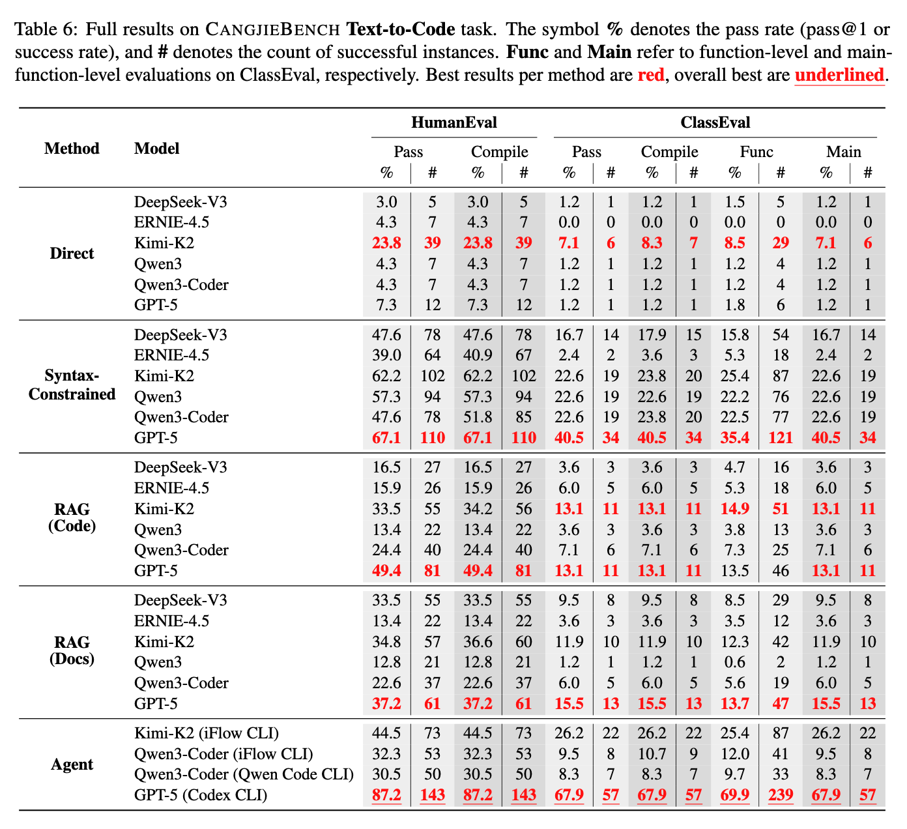
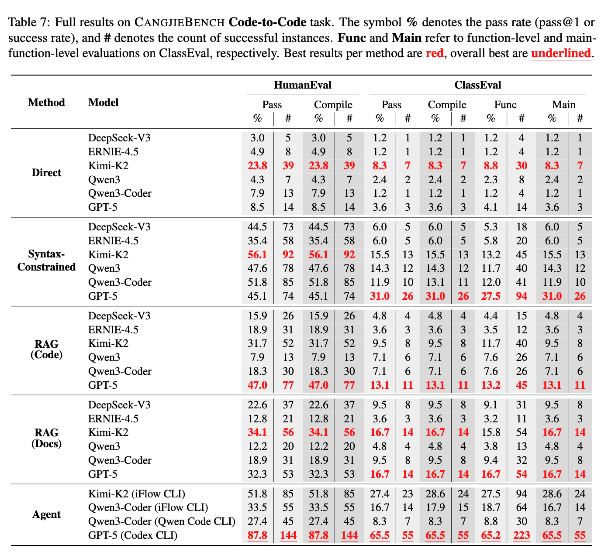
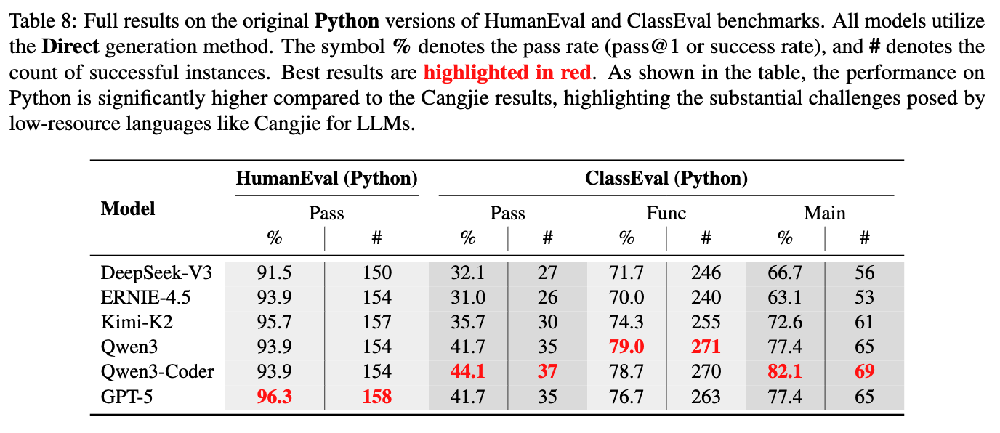
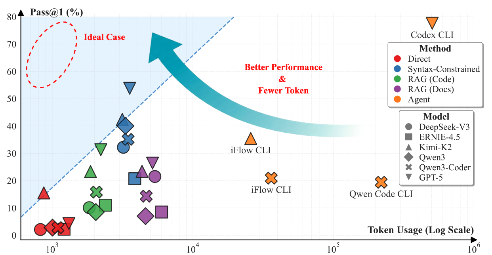
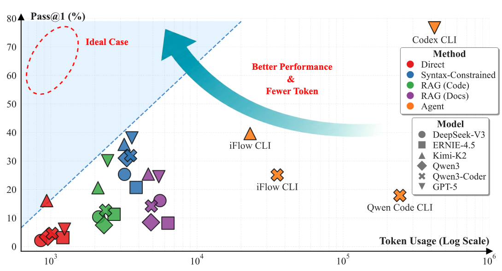

# 📈 实验结果

    <a href="./README.md"><strong>🌐 English</strong></a> &nbsp;|&nbsp; <a href="./README_zh.md"><strong>🇨🇳 中文</strong></a>

> 所有模型与方法的基准评测结果。

---

## 通过率

### Text-to-Code

    

### Code-to-Code

    

### Python 基准

    

---

## Token 使用量

### Text-to-Code

    

### Code-to-Code

    

